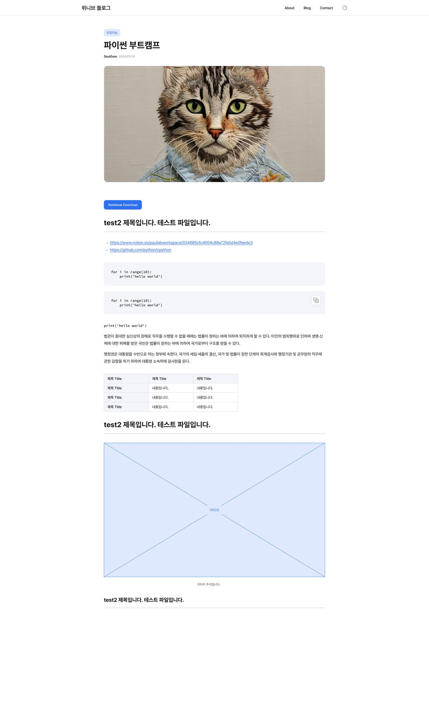

# contact

- hello world
- hello world
- hello world

법관이 중대한 심신상의 장해로 직무를 수행할 수 없을 때에는 법률이 정하는 바에 의하여 퇴직하게 할 수 있다. 타인의 범죄행위로 인하여 생명·신체에 대한 피해를 받은 국민은 법률이 정하는 바에 의하여 국가로부터 구조를 받을 수 있다.

행정권은 대통령을 수반으로 하는 정부에 속한다. 국가의 세입·세출의 결산, 국가 및 법률이 정한 단체의 회계검사와 행정기관 및 공무원의 직무에 관한 감찰을 하기 위하여 대통령 소속하에 감사원을 둔다.

|  |  |  |
| ------------------------------------------------------------------ | -------------------------------------------------------- | -------------------------------------------------------- |

|  이미지 1번 |  이미지 2번 |
| ------------------------------------------------------------------------------------------------------------------------------------------------------------ | ------------------------------------------------------------------------------------------------------------------------------------------------------------ |
